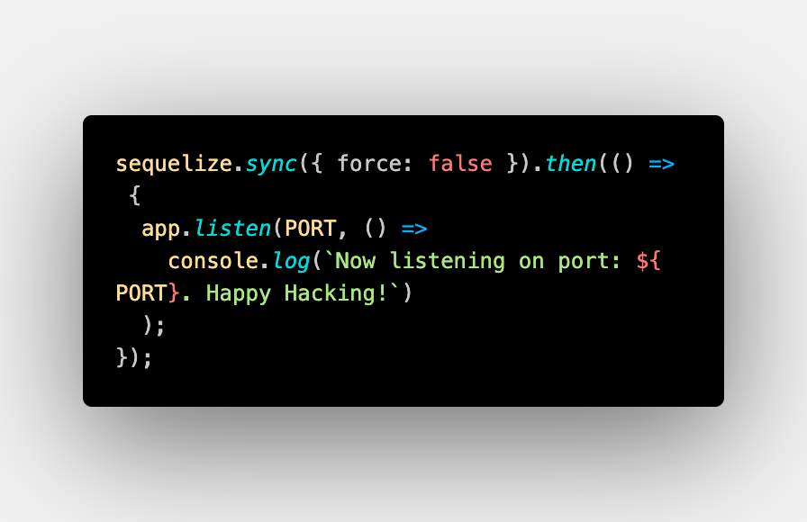

# Object-Relational Mapping(ORM) eCommerce Back End


---

## Table of Contents

- [Description](#description)
- [Installation](#installation)
- [Usage](#usage)
- [Instructions](#instructions)
- [License](#license)
- [Questions](#questions)

---

## Description

This app is a backend application serving front end routes using MySQL with NODE.js, Express.js, and Sequelize. The app is a database for an e-commerce site that allows the user to view, add, update, and delete products, categories, and tags.

---

## Installation

To install necessary dependencies, run the following command:

```
 - npm i
```

---

## Usage

For usage information, please refer to the following links to the video demonstrations and GitHub repository:

## [SetUp](https://youtu.be/uJAQ6Sc2rOo)

## [LocalHost Demo](https://youtu.be/t6bqHNHfE3U)

## [HEROKU Demo](https://youtu.be/KXMEo9p6BaY)

## [GitHub Repository](https://github.com/mrdekraker/orm-e-commerce)

---

## Instructions

To run the application, run the following command:

```
- npm start

- npm start (to start the server)

- update Schema.sql in MySQL

- Stop the server and run 'npm run seed' to seed the database

```

NOTE:
In server.js, you will need to change force: true to force: false to prevent the database from being dropped and re-created every time the server is started. Please see setup video for more help.

## 

---

## License


This project is licensed under the MIT license.

---

## Questions

If you have any questions, please contact me at:

- GitHub: [mrdekraker](https://github.com/mrdekraker)
- Email: [mrdekraker](mailto:mrdekraker@gmail.com)
- Twitter: [@DekrakerMark](https://twitter.com/DekrakerMark)

---

## Contributing

If you would like to contribute to this project, please contact me.

---

## Tests

📐 No tests are available at this time.

---

## Credits

- Mark DeKraker, developer.
- Rice University Coding Bootcamp
- [Node.js](https://nodejs.org/en/)
- [Express.js](https://expressjs.com/)
- [Sequelize](https://sequelize.org/)
- [MySQL](https://www.mysql.com/)
- [dotenv](https://www.npmjs.com/package/dotenv)
- [Insomnia](https://insomnia.rest/)
- [Heroku](https://www.heroku.com/)
